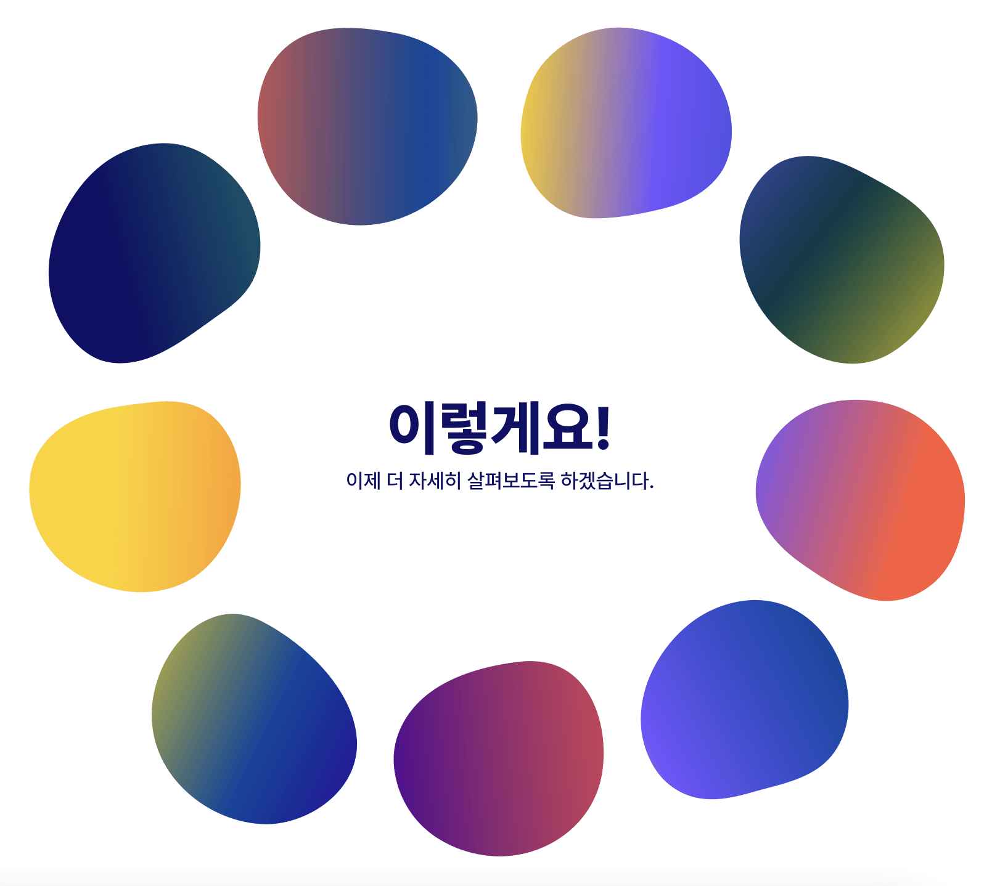
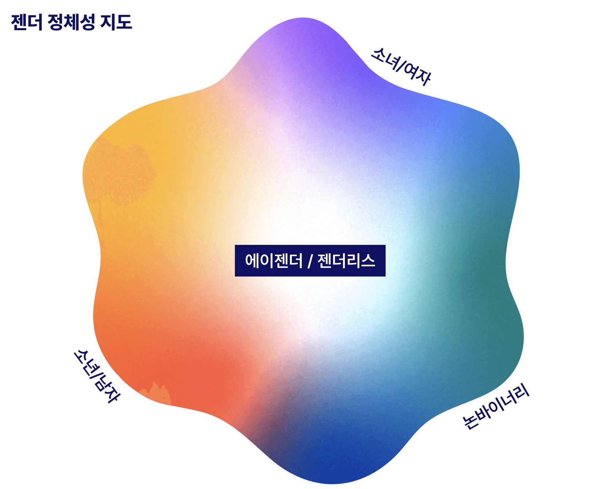
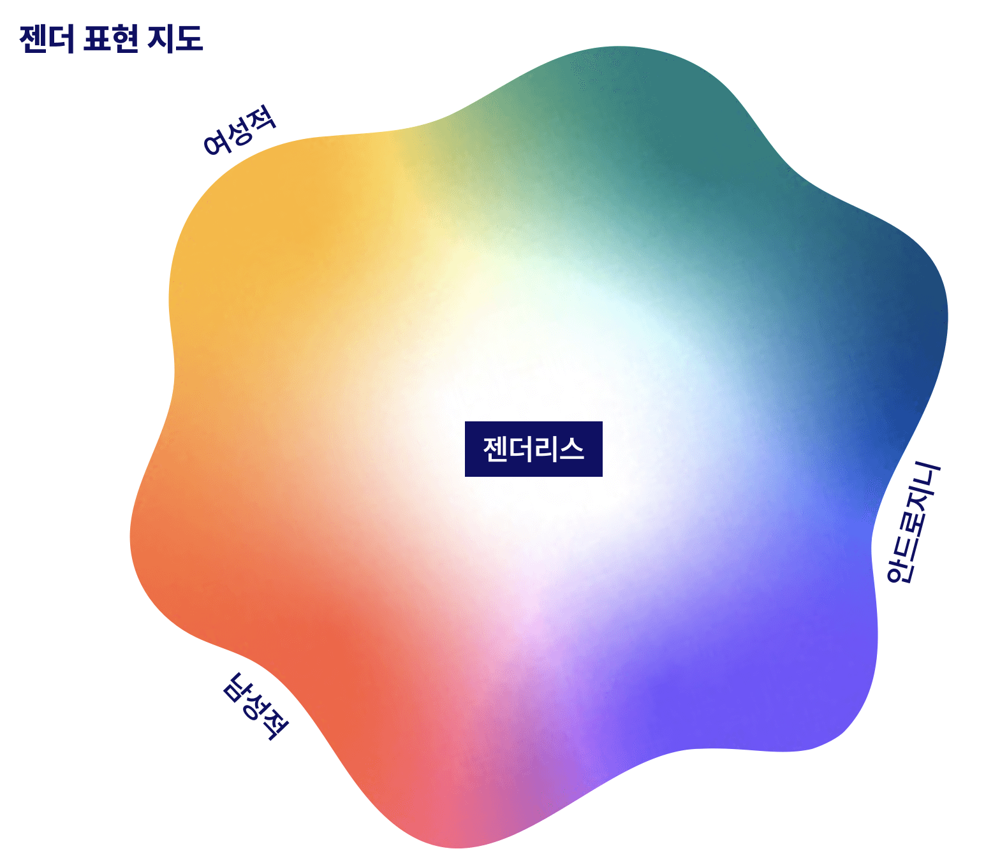
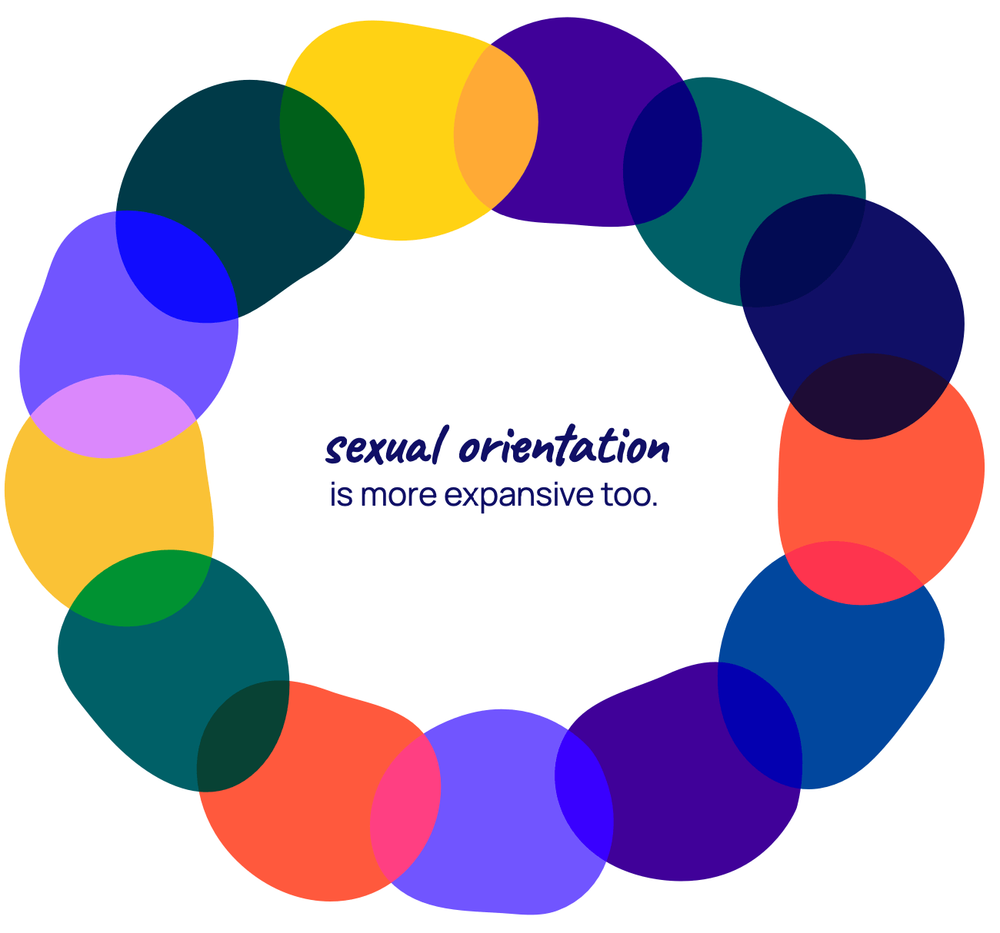
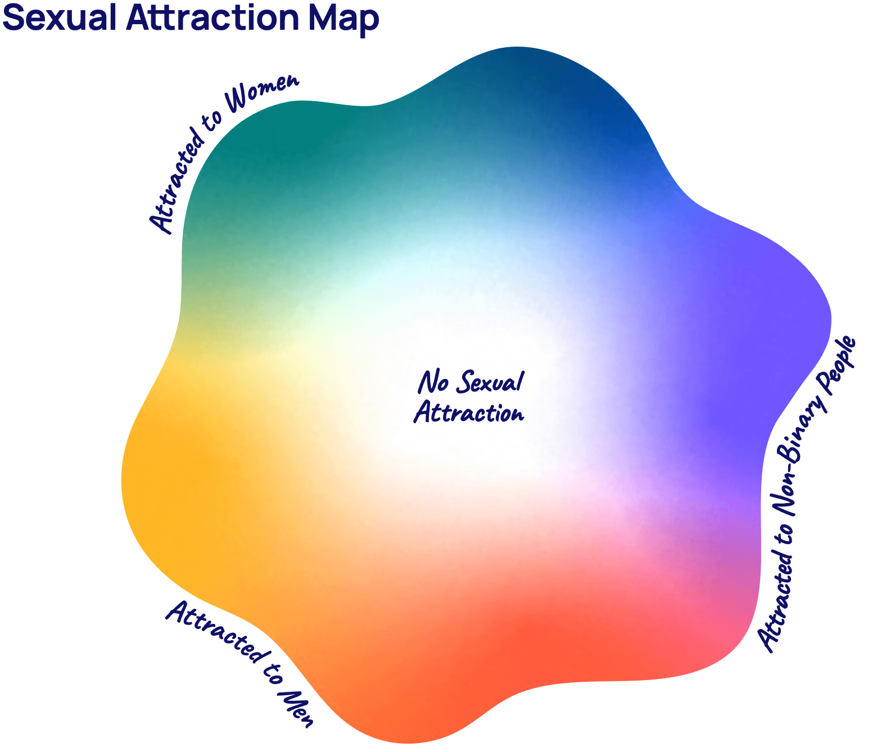
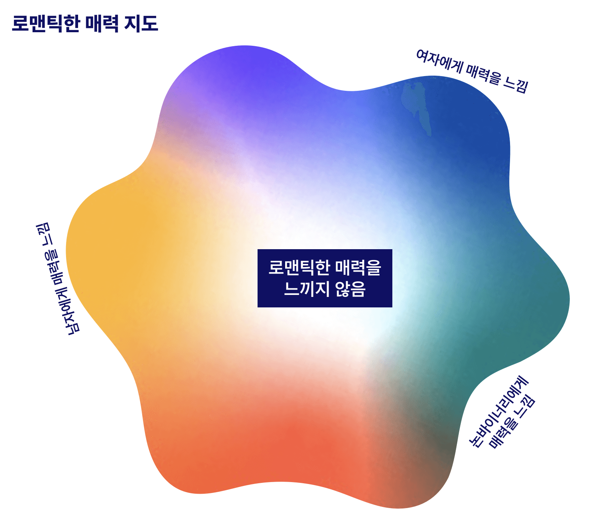
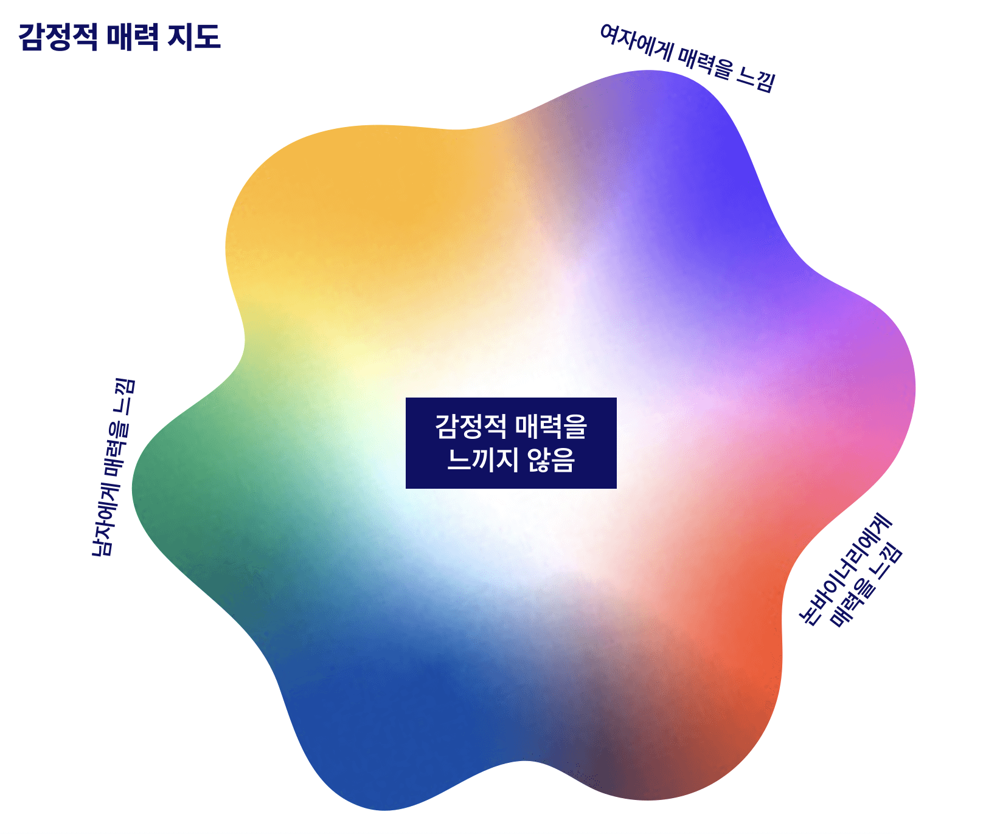

# 커밍아웃 핸드북
유용한 정보와 가이드 질문들을 통해 커밍아웃이 여러분에게 어떤 의미인지 알아보세요.

> 원문을 읽고 싶으신가요? [여기](https://www.thetrevorproject.org/resources/guide/the-coming-out-handbook/)를 확인해보세요.

\
**환영합니다!**

**성적 지향** 및/혹은 **젠더 정체성**에 대해 생각해보게 되면 여러 감정이 들기도 하고 여러 가지 질문들이 생길 수도 있습니다.

이 핸드북에서는 정체성을 탐구해보는 시간을 가져볼 예정입니다. 여러분의 정체성을 다른 사람들에게 알려주는 것이 어떤 것인지 알아보고, 여러분에게 **커밍아웃**이 어떤 의미인지 생각해볼 수 있도록 유용한 정보와 가이드 질문들을 살펴보겠습니다.

사람들이 아주 단편적이고, 판단적, 혹은 무서운 방식으로 "커밍아웃"에 대해 이야기하는 내용을 들어본 적이 있을 것입니다. **하지만 사실은 커밍아웃을 하는 데에 한 가지 정해진 방법만이 있는 것은 아닙니다.** 우리가 살아가면서 우리의 **성적 지향** 및/또는 **젠더 정체성**에 대해 알려주고 싶은 사람들이 있을 수도 있고, 이런 내용을 알려주는 것이 편안하거나 안전하다고 느껴지지 않는 사람들도 있을 수 있습니다. 그래도 괜찮습니다!

> 제 진정한 정체성을 조금씩 알아내가고 있는데, 그러면서 매번 알아가게 되는 제 자신이 점점 더 좋아지게 되는 것 같습니다.
> 
> 헤일리, 16살, 버지니아 주

많은 사람들에게 있어서 **커밍아웃은 한번에 일어나는 일이 아닙니다.** 많은 사람들이 여러 번에 걸쳐서 여러 사람들에게 커밍아웃을 하게 됩니다. 예시로는 인터넷에서 이야기하는 친구들, 신뢰할 수 있는 가족 구성원들, 혹은 삶에서 알고 지내게 되는 사람 한 명이 될 수도 있습니다.

깊이 생각해본 후에 커밍아웃을 결심하더라도, 아무에게나 커밍아웃을 하고 싶지는 않을 수도 있습니다. 그래도 **괜찮습니다**. 많은 사람들이 여러 가지 이유로 커밍아웃을 하지 않기로 결정하기도 합니다. 충분히 그럴 수 있고, 그렇더라도 어떤 이유에서든 사람들의 지지를 받을 수 있어야 합니다.

## 정체성의 종류에 대해 이해하기
인종, 민족, 장애/능력, 출신 국가, 사용하는 언어, 나이, 사회적 계급, 종교/영성 및 여러 범주의 다른 정체성들은 우리가 누구인지를 이루고 있으며, 우리가 고유한 개인으로서 어떤 삶을 살아갔는지 말해주기도 합니다. 젠더 정체성과 성적 지향도 이 퍼즐의 또 다른 한 조각이기도 합니다!

자신의 정체성에 대해 고민하는 것은 매우 일반적인 일입니다. 정체성은 복잡한 문제이기도 하니까요. 아직 완전히 알아내지 못했더라도 괜찮습니다! 지금 당장 완전히 알아낼 필요는 없습니다. (혹은 아예 완전히 알아내지 못하더라도 괜찮습니다). 하지만 여러 가지를 배워보면서 자신의 감정에 대해 고민하는 시간을 가지게 되다보면 자신을 더 잘 이해할 수 있게 될 수도 있습니다.

많은 사람들이 **젠더 정체성**, **출생 시 지정된 성별**, **성적 지향**의 차이에 대해 이해하지 못하곤 합니다. 이런 용어들에 대해 살펴보고 여러분에게 이 용어들이 어떤 의미인지 살펴보겠습니다!

## 출생 시 지정된 성별이 무엇인가요?
성별은 남성, 여성, 혹은 인터섹스로 구분되는 사람의 분류입니다. 아기가 태어날 때, 의사들이 출생 증명서에 기재될 "여성" 혹은 "남성"의 여부를 결정하게 되는데, 이러한 여부는 보통 아기의 생식기를 확인하며 이루어지게 됩니다. 이러한 출생 시 성별 할당은 아기의 생식기를 통해 정해지게 되지만 성징의 범주에 염색체, 성 호르몬과 같이 눈에 보이지 않는 것들이 포함하기도 합니다.

사람들은 서로 다 다릅니다. 그리고 성별만 보더라도 "남성", "여성"만 있는 것이 아닙니다. **인터섹스**는 신체적 성징이나 생식 해부학에서 태어날 때부터 존재하거나 이후에 자발적으로 나타나고, '남성'과 '여성'의 규범적인 예상과 다를 수도 있는 변이를 설명하는 포괄적인 용어입니다.

출생 시 할당된 성별은 아기가 말하거나 걸을 수 있게 되고, 자신에 대해 알게 되기 전에 지정되게 됩니다. 그러므로 성별 할당이 젠더를 결정하진 않습니다. 여러분의 진정한 젠더 정체성이 의사가 지정해준 성별과 다를 수도 있는데, 이는 충분히 일어날수 있는 아름답고 정상적인 현상입니다.

## 젠더가 뭔가요?
어떤 사람들은 젠더가 다음과 같이 생겼다고 말합니다:

또 어떤 사람들은 젠더가 이렇게 생겼다고 말합니다:

사실 젠더는 이렇게 생겼습니다...:

### 젠더 정체성 이해하기
[젠더](https://www.thetrevorproject.org/resources/article/understanding-gender-identities/)는 내면에서 남자, 여자, 논바이너리, 혹은 다른 무언가로 느껴지는 현상을 설명합니다. 모든 사람이 젠더를 다르게 경험하고, 단순히 보는 것만으로는 누군가의 젠더를 알수 없기도 합니다.

**일반적으로 알려진 젠더는 다음을 포함합니다:**

- **시스젠더 (Cisgender):** 젠더 정체성이 출생 시 지정된 성별과 일치하는 사람들.
- **트랜스젠더 (Transgender):** 젠더 정체성이 출생 시 지정된 성별과 다른 사람들. 어떤 사람들은 특정 젠더 확일화 치료를 받을 수도 있지만, 이러한 치료는 필수가 아니며 각자가 개인에게 가장 잘 맞는 방식을 선택할 수 있어야 합니다.
- **논바이너리 (Nonbinary):** 남자/여자의 이분법을 넘어서서 젠더 정체성 및/또는 표현을 경험하는 사람들을 설명하는 포괄적인 용어. 논바이너리의 예시는 젠더플루이드 (genderfluid), 젠더퀴어 (genderqueer), 폴리젠더 (polygender), 바이젠더 (bigender), 에이젠더 (agender) 등을 포함합니다.
- **투스피릿 (Two-Spirit):** 미국의 제1국민/원주민/토착민들이 (남자도 여자도 아니지만 그들 민족에 고유한 독특한 젠더 상태를 타나내는) 식민지적 젠더 이분법의 개념을 넘어서서 존재하는 성적 지향 및/혹은 젠더/성을 설명하기 위해 만들어낸 포괄적인 용어입니다. 이 용어는 미국 제1국민/원주민/토착민이 아닌 사람들에 의해 차용되거나 스스로를 설명할 때 사용되어서는 안됩니다.

어떤 사람들은 남자와 여자 두 가지 젠더만 존재한다고 배우기도 합니다. 하지만 실제로는 사람들이 (두 가지 젠더만 존재한다는) 이런 이분법을 벗어난 젠더를 경험하게 됩니다. 사람이 되는 데에 얼마나 다양한 방식이 있는지 생각해 보세요! 이를 통해 젠더 정체성을 경험하는 방법 또한 그만큼 다양하다는 것을 알수 있습니다.

- **어떤 나이나 어떤 삶의 단계에 있더라도 자신의 젠더 정체성과 자아를 탐구하는 것은 정상적인 일입니다.**
- **나는 내 젠더를 어떻게 경험하고 있을까?**
- **출생 시 지정된 성별에 관해서 나는 어떤 감정을 느끼고 있을까?**
- **젠더가 나에게 어떤 의미일까?**

시각화 하는게 도움이 될 수도 있습니다. 다음 섹션에서는 **젠더 정체성 지도**를 살펴보겠습니다. 이 지도에서 점 하나, 여러 점들, 원 하나, 혹은 원하는 아무 모양을 통해 본인이 어떻게 느끼는지 표시해보세요. 오늘 표시한 방식과 내일, 한 달 뒤, 혹은 1년 뒤에 표시한 방식이 달라도 괜찮습니다. 여러분이 선택할 권리가 있습니다.

### 젠더 표현
- 나는 어떻게 내 젠더를 표현하고 싶을까?
- 이상적인 상황에서, 나는 내 젠더를 어떻게 표현하고 싶을까?
- 젠더 표현의 어떤 측면이 나를 행복하고 참되게 만들까?
- 젠더 표현의 어떤 측면이 나를 슬프게 하고 나 자신이 아닌 것처럼 느끼게 만들까?

다음 섹션에는 꾸며볼 또 다른 지도가 있습니다. 이 지도를 **젠더 표현 지도**라고 부르겠습니다. 시간이 지나면서 여러분의 감정이 변하는 것은 매우 자연스러운 현상입니다. 오랜 시간 동안 (남자와 여자의 특징을 둘 다 띄는) 앤드로지니한 방식으로 표현할수도 있습니다. 한 해 동안은 아주 여성적으로 표현한 후 더 남성적인 표현을 시도해볼 수도 있습니다. 여러분이 누구이든지 간에, 이 지도는 여러분이 젠더 표현과 가지고 있는 개인적인 관계를 반영합니다.

### 젠더 전환은 어떻게 이루어질까요?
전환은 사람마다 다르게 일어나는데, 젠더를 표현하는 올바른 방법은 없습니다. 어떤 사람들은 신체적 혹은 의학적으로 전환을 하지만 어떤 사람들은 하지 않을수도 있습니다. 이는 개인적인 표현, 젠더 확일화 치료의 접근성 부족, 특정 시술을 막는 의학적 상태, 혹은 다른 이유와 관련이 있을 수도 있습니다.

전환은 단순히 수술 이상의 복잡한 과정이며, 사회적, 의학적, 그리고/또는 법적인 측면을 포함하여 여러 해에 걸쳐 이루어질 수도 있습니다. 어떤 사람들은 전혀 전환을 하지 않기도 결정할수도 있습니다. 이는 사회의 지지 부족, 개인 안전에 대한 위협, 또는 다른 개인적인 이유 때문일수도 있습니다. 젠더 정체성을 표현하거나 진실한 삶을 사는 데 있어서 "올바른" 방법은 없습니다.

## 성적 지향이 뭔가요?
어떤 사람들은 성적 지향이 다음과 같이 생겼다고 말합니다:

또 어떤 사람들은 성적 지향이 이렇게 생겼다고 말합니다:

젠더와 마찬가지로, 성적 지향 또한 생각외로 더 넓습니다.

### 성적 지향 이해하기
[성적 지향](https://www.thetrevorproject.org/research-briefs/diversity-of-youth-sexual-orientation/)은 다양한 형태의 성적, 신체적, 로맨틱한 또는 감정적인 매력과 행동, 그리고 정체성을 포함합니다. 이러한 방식들이 성적 지향을 설명하는 가장 흔한 방식이지만, 지적, 감각적, 미적 매력과 같은 다른 종류의 매력도 존재합니다.

우리 사회에서는 보통 모든 사람이 (다른 젠더인 사람에게만 매력을 느끼는 것을 의미하는) 이성애자라고 가정되곤 합니다. 또한 모든 사람이 동일한 방식으로 매력을 경험한다고 가정하기도 합니다. 우리가 배워온 것과는 달리 매력은 사람마다 놀랍고 고유한 방식으로 나타납니다.

한 젠더의 사람들에게만 매력을 느낄 수도 있고, 여러 젠더의 사람들에게 매력을 느낄 수도 있으며, 삶의 다양한 시기에 걸쳐서 여러 젠더의 사람들에게 매력을 느낄 수도 있습니다. [전혀 매력을 느끼지 않을 수도 있습니다.](https://www.thetrevorproject.org/resources/article/understanding-asexuality/) 이는 충분히 일어날 수 있는 현상입니다.

### 성적 매력
성적 매력은 사람들이 성적 지향이나 일반적으로 매력에 대해 생각할 때 가장 먼저 떠올리게 되는 내용들입니다. 이러한 유형의 매력은 다른 사람과 성적으로 친밀해지고 가까워지고 싶다는 욕구로 특정지어집니다. 신체적 매력은 종종 성적 매력의 일부로 간주되기도 합니다. 이런 현상을 경험했다면 신체적으로 매력을 느꼈다고 설명할 수 있습니다.

- **내가 다른 사람과 성적으로 친밀해지고 싶을까?**
- **나는 누구와 성적으로 친밀해지고 싶을까?**
- **내가 누구를 신체적으로 매력적이라고 느낄까?**
- **내가 얼마나 자주 성적/신체적 매력을 느낄까?**

자유롭게 다음 페이지에 있는 **성적 매력 지도** 에 자신이 성적/신체적 매력을 경험하는 방식을 자유롭게 표시해 보세요. 가이드 질문들을 통해 지도 어디에 들어갈지 생각해봐도 좋습니다.

### 로맨틱한 매력
로맨틱한 매력은 종종 다른 사람과의 로맨틱한 친밀감이나 [로맨틱한 관계](https://www.thetrevorproject.org/resources/article/resources-for-healthy-relationships/)에 대한 욕구로 설명되곤 합니다. 이런 로맨틱한 친밀감이나 관계가 어떤 사람들에게는 손을 잡고, 데이트를 하며, 키스하거나 포옹하는 것을 의미할수도 있습니다. 목록에 다른 예시가 계속 들어갈수 있는데, 로맨틱한 매력은 이러한 로맨틱한 표현에 대해 어떻게 개인적으로 느끼는지에 관한 내용입니다.

- **내가 이전에 누군가에게 반해본 적이 있었나?**
- **내가 누구에게 반해본 적이 있었나?**
- **나는 누구와 로맨틱한 행동을 경험해보고 싶은 걸까?**
- **나는 누구와 로맨틱한 관계를 가지고 싶은 걸까?**

다음 페이지에 있는 **로맨틱한 매력 지도**에 어떻게 로맨틱한 매력을 느끼거나 느끼지 않는지 표시해보세요.

### 감정적 매력
감정적 매력은 다른 사람들과 깊은 감정적인 수준에서 연결되고자 하는 욕구로 특정지어집니다. 누군과와 절친이 되고 싶거나 사람들의 성격에 기반해서 감정적인 매력을 느끼는 형태일 수도 있습니다.

- **나는 누구와 감정적으로 가까워지고 싶은 강한 욕구를 느낄까?**
- **내가 감정적으로 유대감을 느끼는 사람은 누구일까?**
- **내가 더 잘 알고 싶은 사람은 누구일까?**

다음 페이지에 있는 감정적 매력 지도에 감정적 매력이 여러분에게 어떻게 나타나는지 그려보면 좋을 것 같습니다. 여러분의 감정적 매력은 어디 쯤에 위치할 것 같나요?

## 커밍아웃 시 고려할 점들
커밍아웃은 매우 개인적인 결정입니다. 맞고 틀린 방법이 없지만 삶에서 누가 여러분을 지지해주는지 파악하는 것이 큰 차이가 될 수도 있습니다.

**커밍아웃을 하는 데에는 많고 다양한 방법들이 있습니다:**

- 누군가에게 전화하기
- 누군가에게 문자 메세지 보내기
- 이메일 보내기
- 편지 쓰기
- 실제로 만나서 이야기하기

### 먼저 계획하기
여러분이 어떤 말을 할지 준비하는 시간을 가지기로 했을수도 있습니다. 어떤 말을 하고싶은지 써보는 것도 도움이 됩니다. 지지해주는 사람들과 연습해보는 것도 어떤 내용을 어떻게 말하고 싶은지 파악하는데 도움이 될수 있습니다.

- **내가 어떻게 커밍아웃을 하고싶은 걸까?**
- **커밍아웃 하고싶은 사람에게 뭐라고 말을 해야할까?**
- **상대방이 뭐라고 말할 것으로 예상이 될까?**
- **커밍아웃을 하기 앞서서 준비하고 싶은 방법이 있을까?**

커밍아웃을 고려하고 있다면 좋고 안좋은 반응들을 포함해서 사람들이 보일 수 있는 다양한 반응에 대해 생각해보는 것이 중요할 수 있습니다. 사람들이 어떻게 반응할지 생각해 볼수 있는 질문들을 확인해보세요:

- **내가 들을수 있는 긍정적인 반응은 무엇일까?**
- **내가 들을수 있는 부정적인 반응은 무엇일까?**
- **커밍아웃하려는 상대방에 대해 내가 알고 있는 것들을 바탕으로, 그 사람의 반응이 어떨 것이라고 예상될까?**
- **내가 상대방으로부터 원하는 반응은 어떤 것일까?**

사람들이 반응이 매우 다양할 수 있다는 점을 참고해주세요.

### 간 보기
사람들이 LGBTQ+인 사람들이나 주제들에 대해 어떻게 느끼는지 알아보는 것이 커밍아웃 이후 반응을 예측하는 데 도움이 될 수도 있습니다. (물론 항상 그렇지는 않습니다.)

**다른 사람들이 간을 볼때 사용한 몇 가지 방법:**

- LGBTQ+인 연예인에 대해 어떻게 생각하는지 물어보기
- 결혼 평등에 대해 어떻게 생각하는지 물어보기 (예: 동성 결혼)
- 유심히 말 들어보기: LGBTQ+인 사람들을 비하하는가? LGBTQ+ 관련 고정관념들을 자주 말하는가?
- 감정적으로 어려운 일들을 어떻게 해쳐나가는지 관찰해보기. 반응을 예상하고 준비하는데 도움이 될수 있습니다.

가끔은 커밍아웃할 사람들이 질문을 많이 할수도 있습니다. 자신의 정체성에 대한 전문가가 될 필요도 없고 모든 질문의 답변을 준비하지 않아도 괜찮습니다. 괜찮다면 이런 질문들을 먼저 생각해보는것도 괜찮지만, 불편할 경우에는 누구에게도 답변할 의무가 없다는 것을 기억해주세요.

### 고려하면 좋은 사회적 요인들

#### 시기
커밍아웃을 하는데 완벽한 시기는 없습니다. 사실 누구에게 이야기하냐에 따라 최적의 시간이 달라질 수도 있습니다. 가끔은 상대방이 편안하고 열린 마음으로 듣고자 할 때가지 기다리는 것이 도움이 되기도 합니다. 어떨 때에는 갑자기 말해야 하는 경우도 있습니다. 여러분이 옳다고 느낄 때가 언제인지가 가장 중요합니다. 적절한 시기를 생각해 보는데 도움이 될수 있는 몇 가지 질문들을 확인해보세요:

- **커밍아웃을 하기에 나에게 가장 좋은 시간은 언제일까?**
- **어느 시간대가 이야기를 나누기에 좋은 시간으로 느껴질까? (학교 가기 전, 퇴근 후, 저녁 시간 등)**
- **한 해의 어떤 시기가 이야기를 나누기에 좋은 시기로 느껴질까? (학기 전, 여름, 휴일 등)**
- **커밍아웃할 상대방에게 가장 좋은 시간은 언제일까?**

#### 위치와 환경
시기와 마찬가지로 커밍아웃을 하는 데에 완벽한 장소 또한 없습니다. 어떤 장소가 다른 장소보다 더 안전하고 편안할수도 있습니다.

- **공공 장소가 좋을까, 개인적인 공간이 좋을까?**
- **집이 이야기를 나누기에 안전한 장소로 느껴질까?**
- **나와 상대방 둘 다 편안하게 이야기할수 있는 장소가 어디일까?**
- **나와 이야기하는 사람에게 특별하게 느껴지는 장소가 있을까?**

#### 학교
어떤 사람들에게는 학교에서 커밍아웃하는 것이 다른 LGBTQ+인 급우들과 연결될 수 있는 좋은 기회가 될 수도 있습니다. 하지만 학교는 많은 사람들에게 있어서 안전하지 않은 장소일 수 있습니다. 학교에서 커밍아웃을 고려할 때, 여러분의 안전과 안녕을 항상 우선시해주세요. 어려운 시간을 보낼 것 같다고 생각이 든다면 학교에서의 안전 계획을 세우는 것도 도움이 될수 있습니다.

- **학교에서 커밍아웃을 하면 어떤 느낌이 들까?**
- **학교에서 누구에게 알려주고 싶을까?**
- **내가 다니는 학교에 지지해줄 수 있는 교직원, 상담사, 선생님 또는 다른 어른들이 있을까?**
- **내가 참석하기 편안하게 느껴지는 젠더, 섹슈얼리티 연합 (Gender & Sexuality Alliance / GSA) 이나 비슷한 동아리/커뮤니티가 있을까?**
- **시행되고 있는 LGBTQ+인 학생들을 보호하는 반 괴롭힘 정책이 있을까?**
- **커밍아웃하는 것이 내 안전을 위협할 가능성이 있을까? 있다면 안전을 유지하기 위해 어떤 조치를 취할 수 있을까?**

### 지원 체계
어떤 일이 있든 항상 지지해줄수 있는 사람들을 생각해보세요.

- **내가 안전하다고 느끼는 사람은 누구일까?**
- **내 삶에 대해 이야기할때 편안하게 이야기할수 있는 사람은 누구일까?**
- **무슨 일이 있어도 나를 지지해줄수 있는 사람은 누구일까?**
- **내 자신감을 북돋아주는 사람은 누구일까?**

이렇게 지지해줄수 있는 사람들에는 다음이 있습니다:
- 실제 삶 혹은 온라인에서 이야기하는 친구들, 학급 친구들
- 팀원 (예: 스터디 그룹 조장, 동아리 회원, 학원 친구 등), 동아리 회원, 온라인 커뮤니티
- 선생님, 상담사, 의사, 직장 동료
- 가족 구성원, 돌봄 제공자, 부모, 형제자매, 사촌, 이웃
- 종교나 영적 지도자

## 커밍아웃 시 안전 고려사항
가끔은 커밍아웃이 우리가 계획한 대로 흘러가지 않을 수도 있습니다. 우리가 바랬던 방향으로 사람들이 반응하지 않더라도 여러분 정체성의 진실성에 영향을 끼치지 않으며 여러분의 잘못도 아니라는 점을 명심해주세요. 여러분은 열린 마음과 배려, 사랑으로 받아들여질 자격이 있습니다. 만약 상황이 안전해지지 않을것 같다는 느낌이 든다면 주거, 음식, 학교, 교통 수단 등의 제 2의 계획을 준비해두는 것이 좋을 수도 있습니다. 여러분의 안전과 안녕이 최우선입니다. Trevor Project는 언제나 여러분을 도와주기 위해 준비돼 있습니다.

아래의 **자료** 섹션에서 커밍아웃 전후에 도움이 될수 있는 지역 및/또는 온라인 자료들을 확인해보세요.

## 건강한 관계
여러분이 스스로의 정체성을 탐구하고 커밍아웃을 하는 과정에서, 특별한 사람과의 [데이트나 관계를 고려하는 것]((https://www.thetrevorproject.org/resources/article/crushes-early-relationships/))이 이 과정의 매우 중요한 부분이 될수 있습니다. 새로운 사람들을 알게 되면서 많이 신나기도 하고 약간은 불안감이 들 수도 있습니다.

이 과정에서, [건강한 관계와 건강하지 않은 관계](https://www.thetrevorproject.org/resources/article/resources-for-healthy-relationships/)의 차이를 알아 두는 것이 중요합니다. 오직 여러분만이 여러분의 예상, 경계, 그리고 필요를 결정할 수 있습니다. 여러분이 무언가가 잘못되었다고 느낄 때 표현할 권리가 있으며, 데이트하는 사람과 안전하게 느끼고 안심할 수 있어야 한다는 점을 기억해주세요.

- **건강한 관계**는 신뢰, 정직, 상호 존중, 열린 소통, 그리고 무엇보다 안전하고 안심할 수 있는 느낌으로 특정지어질수 있습니다.
- **건강하지 않은 관계**는 통제하는 요소들로 이루어질 수도 있는데, 이런 요소들은 종종 신체적, 감정적, 그리고/또는 성적일 수 있습니다. 폭력, 강압, 또는 혹은 종류의 강제성도 건강하지 않으며, 이러한 강제성으로는 모든 파트너에게 있어서 안전하고 존중받는 공간을 만들 수 없습니다.
- 성적, 신체적, 및/혹은 로맨틱한 친말감에 **동의**하는 것은 매우 중요하며 반드시 각 개인에 의해 적극적으로 자유롭게 이루어져야 합니다. 여러분은 어떤 이유가 됐든, 그 사람과 이전에 친밀했든 아니든, 다른 행동에 동의한 적이 있든지 없든지의 여부와 관계없이, 친밀한 경험을 중단하거나 거부할 권리가 있습니다. 이는 여러분과 친밀해지는 상대방에게도 해당합니다. 모든 사람이 동의하는 것이 중요합니다.

## 자기 돌봄 연습하기
커밍아웃과 자신에 대해 더 알아가는 것은 때때로 감정의 기복이 심한 롤러코스터처럼 느껴질 수 있습니다. 건강을 유지하려면 자신이 배려받고 있고, 진정되고, 현재 일어나고 있는 모든 일에 대처할 수 있다고 느낄수 있는 방법을 찾는 것이 중요합니다. 이를 "[자기 돌봄](https://www.thetrevorproject.org/resources/guide/self-care-guide/)" 이라고 하며 이는 자신을 돌보는 것에 관한 내용입니다. 자신만의 자기 돌봄 아이디어를 만들어내는 것은 정신적, 신체적 건강을 우선시하는 데 도움이 될수 있습니다.

- **어려운 일을 겪을 때, 나는 어떻게 대처를 할까?**
- **무엇이 나를 건강하고, 진정되고, 긍정적이게 해줄까?**
- **지지가 필요할 때 누구에게 전화를 걸거나, 문자하거나, 이야기할 수 있을까?**
- **내가 좋아하는 일들이 무엇일까?**
- **미래에 대한 나의 목표는 무엇일까?**
- **내가 시도해보고 싶은 자기 돌봄 활동은 무엇일까?**

**자기 돌봄을 할때 시도해볼만한 아이디어들을 한번 살펴보세요:**

- 관심사에 집중하기: 즐겁게 할수 있는 일을 해보세요. 일기장에 생각을 쓰거나, 감정을 표현할수 있는 예술 프로젝트를 만들어보세요.
- 몸과 하나되기: 깊게 숨을 들이마셔보세요. 샤워나 목욕을 해보세요. 어떤 사람들은 요가, 걷기, 달리기와 같은 움직이는 활동이 도움이 된다고 느끼기도 합니다. 여러분이 스스로의 몸을 가장 잘 알고 있으며 무엇이 좋은지 알고 있다는 것을 명심해주세요.
- 친구에게 전화하거나 문자를 보내거나 이야기하여 지지를 받아보세요.
- 슬프거나 안전하지 않다고 느낄 때 삶에서 지지해줄수 있는 사람과 이야기해보세요.
- 스트레스가 많은 상황에서 벗어나야 할 경우에 찾아갈 수 있는 안전한 장소를 알아보세요.
- 교육된 상담사와 [**TrevorLifeline**, **TrevorText**, 혹은 **TrevorChat**](https://www.thetrevorproject.org/get-help/) 을 통해 연결해보세요. (영어)
- **[TrevorSpace](https://www.trevorspace.org/)** 에 로그인하여 LGBTQ+인 청소년들과 연결해보세요. (영어)
- 헤드폰을 끼고 좋아하는 음악을 들어보세요.
- 좋아하는 드라마를 보고 휴식을 취해보세요.
- 여러분은 있는 그대로 소중한 사람임을 잊지 말아주세요.

## 커뮤니티 케어
주변 사람들에게 의지하는 것이 혼자서 하는 것보다 낫습니다. 사회에서 케어를 받고 다른 사람들도 케어해주는 데에는 여러 가지 방법들이 있습니다. 살고있는 동네의 LGBTQ+ 센터를 방문하거나, 온라인에서 사람들과 연결하거나, 혹은 다른 방식으로 커뮤니티를 형성하는 것이 매우 유익할 수 있습니다.

**많은 LGBTQ+ 센터에서는 다음과 같은 서비스를 제공합니다:**
- [LGBTQ+ 친화적인 정신 및 의료 건강 제공자](https://www.thetrevorproject.org/resources/guide/lgbtq-youth-health-care/), 법률 서비스, 비영리 프로그램, 주거/쉼터 필요 등에 대한 직접적인 접근 또는 추천.
- 프로그램 개발 또는 사건 해결을 지원하는 상담 서비스
- 기관, 지구 (districts), 학교 등을 위한 [문화적 역량 교육](https://www.thetrevorproject.org/ally-training/)
- LGBTQ+ 친화적이고 정보가 풍부한 정신 건강 전문가가 상시 근무
- 청소년과 성인을 위한 프로그램

**TrevorSpace**는 LGBTQ+인 청소년들이 연결하고 커뮤니티를 형성할 수 있는 글로벌 온라인 커뮤니티입니다.

## 정신 건강 점검하기

### 경고 신호
특히 삶에서 보는 사람들이 지지해주지 않을 때 슬프고 외로운 느낌이 압도적으로 다가올 수 있습니다. 이러한 감정은 완전히 정상이지만, 더 큰 정신 건강 문제의 경고 신호를 놓치지 않는 것이 중요합니다. 여러분은 혼자가 아니며, 도움을 요청하는 것은 강함의 표시입니다.

**다음과 같이 느낀 적이 있으신가요?**:

- 내가 중요하지 않다고 느낌
- 혼자라고 느낌
- 충동적임
- 자살 충동이 듬
- 압도됨 / 무기력함
- 갇힌 느낌이 듬 / 희망이 없다고 느낌
- 분노 / 짜증

**다음과 같은 행동을 한 적이 있으신가요?**:

- 자신의 가장 소중한 소유물을 남에게 줌
- 좋아하던 것들에 대한 흥미를 상실함
- 유서나 편지를 작성하며 죽음을 계획함
- 평소보다 많이 또는 적게 먹음 / 평소보다 많이 또는 적게 잠
- 평소보다 더 자주 아프거나 피곤하거나 통증을 느낌
- 평소보다 더 많이 약물이나 알코올을 사용함

**다음과 같은 생각을 하시나요?:**

- 미래에 대해 신경쓰지 않음
- 자신을 비하함 (그리고 본인이 비하받아야 마땅하다고 생각함)
- 중요한 사람들에게 작별 인사를 계획함
- 자살에 대한 구체적인 계획을 가지고 있음

이 질문들 중 하나라도 "예" 라고 답했다면 교육받은 위기 상담사에게 지원을 요청할 수 있습니다. **[TrevorLifeline](tel:1-866-488-7386)** 에 전화하거나, TrevorText 이용을 위해 **[678678](tel:678-678)** 번호에 **START** 라고 문자를 보내거나, [**TrevorChat**](https://www.thetrevorproject.org/webchat) 웹사이트를 방문해보세요. 24시간 도움을 드리기 위해 기라디고 있겠습니다. 당신은 혼자가 아닙니다.

(한국에서는 해당 번호로 전화가 걸리지 않을 수도 있습니다.)

## 추가 LGBTQ+ 친화적 자료
젠더:

- [Gender Spectrum](https://www.genderspectrum.org/)
- [TransLifeline](https://translifeline.org/)
- [Trans Youth Family Allies](http://www.imatyfa.org/)

법률:

- [Lambda Legal](https://lambdalegal.org/)
- [Human Rights Campaign](https://www.hrc.org/)

정신 건강:

- [Online Therapy](https://www.onlinetherapy.com/)
- [988SuicidePreventionLifeline](https://988lifeline.org/)
- [It Gets Better Project](https://itgetsbetter.org/)
- [Scarleteen](https://www.scarleteen.com/)

가족과 지역사회:

- [Family Acceptance Project](https://familyproject.sfsu.edu/)
- [Gay, Lesbian, Straight Education Network](https://www.glsen.org/)
- [GLBT Historical Society](https://www.glbthistory.org/)
- [GSA Network](https://gsanetwork.org/)
- [Parents, Families, and](https://pflag.org/) [Friends of Lesbians and Gays](https://pflag.org/)
- [The Institute for Welcoming Resources](http://www.welcomingresources.org/)
- [Centerlink](https://www.lgbtqcenters.org/)
- [LGBTQ+ National Help Center](https://lgbthotline.org/)

## Trevor 프로그램
**자신의 정체성 지도 그리기**

이 핸드북의 **기본 정보 (Basics)** 섹션에서 **젠더 정체성**과 **성적 지향 지도**를 다운로드하고 인쇄하여 현재 자신이 느끼는 대로 작성해보세요. 모든 것을 당장 다 알아낼 필요는 없습니다.

내일, 다음 주, 또는 내년에 생각이 바뀌고 다르게 느끼는 것도 괜찮습니다.

**The Trevor Project는 레즈비언, 게이, 양성애자, 트랜스젠더, 퀴어 및 의문이 생긴 (LGBTQ+) 청소년 자살 예방 선도 단체입니다.**

우리는 자살 예방 전화, 문자, 채팅을 통해 24시간 내내 LGBTQ+ 청소년들을 위한 위기 지원 서비스를 제공합니다. 우리는 또한 혁신적인 연구, 옹호, 공공 교육 및 동료 지원 프로그램을 운영합니다.

[PDF 포맷 다운로드](https://www.thetrevorproject.org/wp-content/uploads/2021/08/TTP_Coming-Out-A-Handbook-for-LGBTQ-Young-People.pdf)