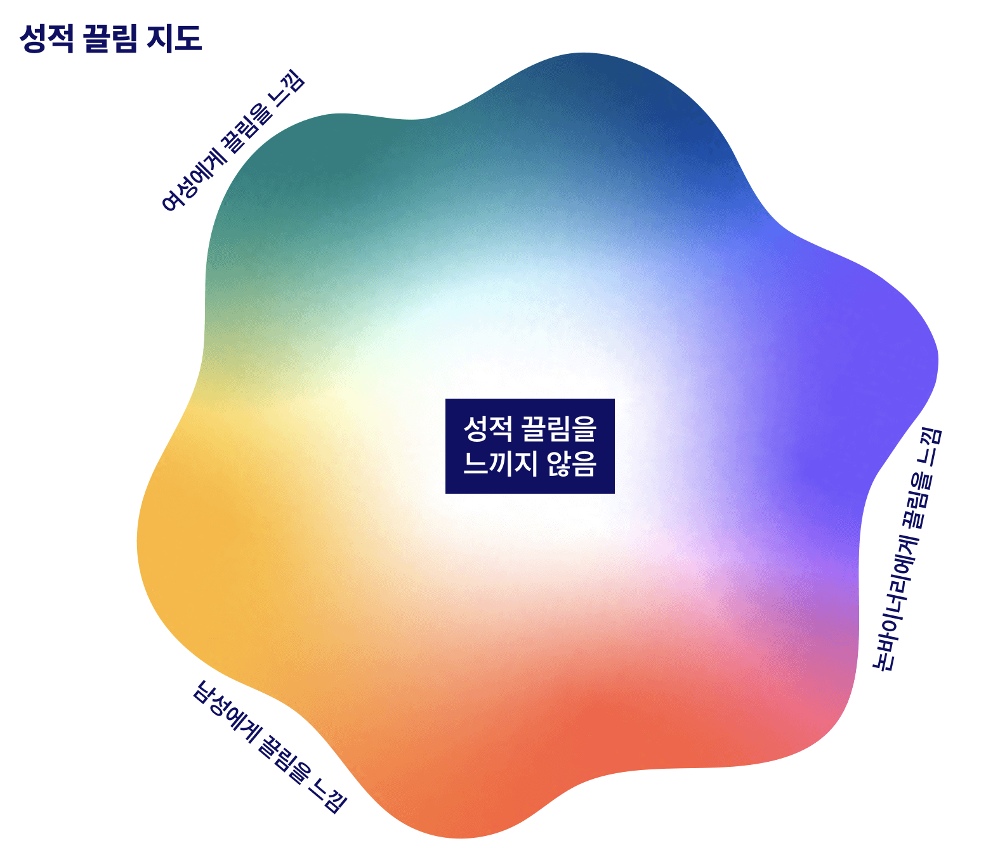

# 커밍아웃 핸드북
유용한 정보와 가이드 질문들을 통해 커밍아웃이 여러분에게 어떤 의미인지 알아보세요.

> 원문을 읽고 싶으신가요? [여기](https://www.thetrevorproject.org/resources/guide/the-coming-out-handbook/)를 확인해보세요.

\
**환영합니다!**

**성적 지향** 및/혹은 **젠더 정체성** 에 대해 생각해보게 되면 여러 감정이 들기도 하고 여러 질문들이 생길 수도 있습니다.

이 핸드북에서는 정체성을 탐구해보는 시간을 가져볼 예정입니다. 여러분의 정체성을 다른 사람들에게 알려주는 것이 어떤 것인지 알아보고, 여러분에게 **커밍아웃**이 어떤 의미인지 생각해볼 수 있도록 유용한 정보와 가이드 질문들을 살펴보겠습니다.

사람들이 아주 단편적이고, 판단적, 혹은 무서운 방식으로 "커밍아웃"에 대해 이야기하는 내용을 들어본 적이 있을 것입니다. **하지만 사실은 커밍아웃을 하는 한 가지 정해진 방법만이 있는 게 아닙니다.** 우리가 살아가면서 우리의 **성적 지향** 및/또는 **젠더 정체성**에 대해 알려주고 싶은 사람들이 있을 수도 있고, 이런 내용을 알려주는 것이 편안하거나 안전하다고 느껴지지 않는 사람들도 있을 수 있습니다. 그래도 괜찮습니다!

> 제 진정한 정체성을 조금씩 알아내가고 있는데, 그러면서 매번 알아가게 되는 제 자신이 더 좋아지게 되는 것 같습니다.
> 
> 헤일리, 16살, 버지니아 주

많은 사람들에게 있어서 **커밍아웃은 한번에 일어나는 일이 아닙니다.** 많은 사람들이 여러 번에 걸쳐서 여러 사람들에게 커밍아웃을 하게 됩니다. 예시로는 인터넷에서 이야기하는 친구들, 신뢰할 수 있는 가족 구성원들, 혹은 삶에서 알고 지내게 되는 사람 한 명이 될 수도 있습니다.

깊이 생각해본 후에 커밍아웃을 결심하더라도, 아무에게나 커밍아웃을 하고 싶지 않을수도 있습니다. 그래도 **괜찮습니다**. 많은 사람들이 여러가지 이유로 커밍아웃을 하지 않기로 결정하기도 합니다. 충분히 그럴 수 있고, 그렇더라도 어떤 이유에서든 사람들의 지지를 받을 수 있어야 합니다.

## 정체성의 종류에 대해 이해하기
인종, 민족, 장애/능력, 출신 국가, 사용하는 언어, 나이, 사회적 계급, 종교/영성 및 여러 범주의 다른 정체성들은 우리가 누구인지를 이루고 있으며, 우리가 고유한 개인으로서 어떤 삶을 살아갔는지 말해주기도 합니다. 젠더 정체성과 성적 지향도 이 퍼즐의 또 다른 한 조각이기도 합니다!

자신의 정체성에 대해 고민하는 것은 매우 일반적인 일입니다. 정체성은 복잡한 문제이기도 하니까요. 아직 완전히 알아내지 못했더라도 괜찮습니다! 지금 당장 완전히 알아낼 필요는 없습니다. (혹은 아예 완전히 알아내지 못하더라도 괜찮습니다). 하지만 여러가지를 배워보면서 자신의 감정에 대해 고민하는 시간을 가지게 되다보면 자신을 더 잘 이해할 수 있게 될수도 있습니다.

많은 사람들이 **젠더 정체성**, **출생 시 지정된 성별**, **성적 지향**의 차이에 대해 이해하지 못하곤 합니다. 이런 용어들에 대해 살펴보고 여러분에게 이 용어들이 어떤 의미인지 살펴보겠습니다!

## 출생 시 지정된 성별이 무엇인가요?
성별은 남성, 여성, 혹은 인터섹스로 구분되는 사람의 분류입니다. 아기가 태어날 때, 의사들이 출생 증명서에 기재될 "여성" 혹은 "남성"의 여부를 결정하게 되는데, 이러한 여부는 보통 아기의 생식기를 확인하며 이루어지게 됩니다. 이러한 출생 시 성별 할당은 아기의 생식기를 통해 정해지게 되지만 성징의 범주에 염색체, 성 호르몬과 같이 눈에 보이지 않는 것들이 포함하기도 합니다.

사람들은 서로 다 다릅니다. 그리고 성별만 보더라도 "남성", "여성"만 있는 것이 아닙니다. **인터섹스**는 신체적 성징이나 생식 해부학에서 태어날 때부터 존재하거나 이후에 자발적으로 나타나고, '남성'과 '여성'의 규범적인 예상과 다를 수도 있는 변이를 설명하는 포괄적인 용어입니다.

출생 시 할당된 성별은 아기가 말하거나 걸을 수 있게 되고, 자신에 대해 알게 되기 전에 지정되게 됩니다. 그러므로 성별 할당이 젠더를 결정하진 않습니다. 여러분의 진정한 젠더 정체성이 의사가 지정해준 성별과 다를 수도 있는데, 이는 충분히 일어날수 있는 아름답고 정상적인 현상입니다.

## 젠더가 뭔가요?
어떤 사람들은 젠더가 다음과 같이 생겼다고 말합니다:

또 어떤 사람들은 젠더가 이렇게 생겼다고 말합니다:

사실 젠더는 이렇게 생겼습니다...:

### 젠더 정체성 이해하기
[젠더](https://www.thetrevorproject.org/resources/article/understanding-gender-identities/)는 내면에서 남자, 여자, 논바이너리, 혹은 다른 무언가로 느껴지는 현상을 설명합니다. 모든 사람이 젠더를 다르게 경험하고, 단순히 보는 것만으로는 누군가의 젠더를 알수 없기도 합니다.

**일반적으로 알려진 젠더는 다음을 포함합니다:**

- **시스젠더:** 젠더 정체성이 출생 시 지정된 성별과 일치하는 사람들.
- **트랜스젠더:** 젠더 정체성이 출생 시 지정된 성별과 다른 사람들. 어떤 사람들은 특정 젠더 확일화 치료를 받을 수도 있지만, 이러한 치료는 필수가 아니며 각자가 개인에게 가장 잘 맞는 방식을 선택할 수 있어야 합니다.
- **논바이너리:** 남자/여자의 이분법을 넘어서서 젠더 정체성 및/또는 표현을 경험하는 사람들을 설명하는 포괄적인 용어. 논바이너리의 예시는 젠더플루이드 (genderfluid), 젠더퀴어 (genderqueer), 폴리젠더 (polygender), 바이젠더 (bigender), 에이젠더 (agender) 등을 포함합니다.
- **투스피릿:** 미국의 제1국민/원주민/토착민들이 (남자도 여자도 아니지만 그들 민족에 고유한 독특한 젠더 상태를 타나내는) 식민지적 젠더 이분법의 개념을 넘어서서 존재하는 성적 지향 및/혹은 젠더/성을 설명하기 위해 만들어낸 포괄적인 용어입니다. 이 용어는 미국 제1국민/원주민/토착민이 아닌 사람들에 의해 차용되거나 스스로를 설명할 때 사용되어서는 안됩니다.

어떤 사람들은 남자와 여자 두 가지 젠더만 존재한다고 배우기도 합니다. 하지만 실제로는 사람들이 (두 가지 젠더만 존재한다는) 그 이분법을 벗어난 젠더를 경험하게 됩니다. 사람이 되는 데에 얼마나 다양한 방식이 있는지 생각해 보세요! 이는 젠더 정체성을 경험하는 방법 또한 그만큼 다양하다는 것을 의미합니다.

- **어떤 나이나 어떤 삶의 단계에 있더라도 자신의 젠더 정체성과 자아를 탐구하는 것은 정상적인 일입니다.**
- **나는 내 젠더를 어떻게 경험하고 있을까?**
- **출생 시 지정된 성별에 관해서 나는 어떤 감정을 느끼고 있을까?**
- **젠더가 나에게 어떤 의미일까?**

시각화 하는 게 도움이 될 수도 있습니다. 다음 섹션에서는 **젠더 정체성 지도**를 살펴보겠습니다. 이 지도에서 점 하나, 여러 점들, 원 하나, 혹은 원하는 아무 모양을 통해 본인이 어떻게 느끼는지 표시해보세요. 오늘 표시한 방식과 내일, 한 달 뒤, 혹은 1년 뒤에 표시한 방식이 달라도 괜찮습니다. 여러분이 선택할 권리가 있습니다.

### 젠더 표현
- 나는 어떻게 내 젠더를 표현하고 싶을까?
- 이상적인 상황에서, 나는 내 젠더를 어떻게 표현하고 싶을까?
- 젠더 표현의 어떤 측면의 나를 행복하고 참되게 만들까?
- 젠더 표현의 어떤 측면이 나를 슬프게 하고 나 자신이 아닌 것처럼 느끼게 만들까?

다음 섹션에는 꾸며볼 또 다른 지도가 있습니다. 이 지도를 **젠더 표현 지도**라고 부르겠습니다. 시간이 지나면서 여러분의 감정이 변하는 것은 매우 자연스러운 현상입니다. 오랜 시간 동안 (남자와 여자의 특징을 둘 다 띄는) 앤드로지니한 방식으로 표현할수도 있습니다. 한 해 동안은 아주 여성적으로 표현한 후 더 남성적인 표현을 시도해볼 수도 있습니다. 여러분이 누구이든지 간에, 이 지도는 여러분이 젠더 표현과 가지고 있는 개인적인 관계를 반영합니다.

### 젠더 전환은 어떻게 이루어질까요?
전환은 사람마다 다르게 일어나는데, 젠더를 표현하는 올바른 방법은 없습니다. 어떤 사람들은 신체적 혹은 의학적으로 전환을 하지만 어떤 사람들은 하지 않을수도 있습니다. 이는 개인적인 표현, 젠더 확일화 치료의 접근성 부족, 특정 시술을 막는 의학적 상태, 혹은 다른 이유와 관련이 있을 수도 있습니다.

전환은 단순히 수술 이상의 복잡한 과정이며, 사회적, 의학적, 그리고/또는 법적인 측면을 포함하여 여러 해에 걸쳐 이루어질 수도 있습니다. 어떤 사람들은 전혀 전환을 하지 않기도 결정할수도 있습니다. 이는 사회의 지지 부족, 개인 안전에 대한 위협, 또는 다른 개인적인 이유 때문일수도 있습니다. 젠더 정체성을 표현하거나 진실한 삶을 사는 데 있어서 "올바른" 방법은 없습니다.

## 성적 지향이 뭔가요?
어떤 사람들은 성적 지향이 다음과 같이 생겼다고 말합니다:

또 어떤 사람들은 성적 지향이 이렇게 생겼다고 말합니다:

젠더와 마찬가지로, 성적 지향도 생각외로 더 넓습니다.

### 성적 지향 이해하기
[성적 지향](https://www.thetrevorproject.org/research-briefs/diversity-of-youth-sexual-orientation/)은 다양한 형태의 성적, 신체적, 로맨틱 혹은 감정적 매력과 행동, 그리고 정체성을 포함합니다. 이러한 방식들이 성적 지향을 설명하는 가장 흔한 방식이지만, 지적, 감각적, 미적 매력과 같은 다른 종류의 매력도 존재합니다.

우리 사회에서는 보통 모든 사람이 (다른 성젠더 사람에게만 매력을 느끼는 것을 의미하는) 이성애자라고 가정되곤 합니다. 또한 모든 사람이 동일한 방식으로 매력을 경험한다고 가정하기도 합니다. 우리가 배워온 것과는 달리 매력은 사람마다 놀랍고 고유한 방식으로 나타납니다.

한 젠더의 사람들에게만 매력을 느낄 수도 있고, 여러 젠더의 사람들에게 매력을 느낄 수도 있으며, 삶의 다양한 시기에 거쳐서 여러 젠더의 사람들에게 매력을 느낄 수도 있습니다. [전혀 매력을 느끼지 않을 수도 있습니다.](https://www.thetrevorproject.org/resources/article/understanding-asexuality/) 이는 충분히 일어날 수 있는 현상입니다.

### 성적 매력
성적 매력은 사람들이 성적 지향 또는 일반적으로 매력에 대해 생각할 때 가장 먼저 떠올리게 되는 내용들입니다. 이러한 유형의 매력은 다른 사람과 성적으로 친밀해지고 가까워지고 싶다는 욕구로 특정지어집니다. 신체적 매력은 종종 성적 매력의 일부로 간주되기도 합니다. 이런 현상을 경험했다면 신체적으로 매력을 느꼈다고 설명할수 있습니다.

- **내가 다른 사람과 성적으로 친밀해지고 싶을까?**
- **나는 누구와 성적으로 친밀해지고 싶을까?**
- **내가 누구를 신체적으로 매력적이라고 느낄까?**
- **내가 얼마나 자주 성적/신체적 매력을 느낄까?**

자유롭게 다음 페이지에 있는 **성적 매력 지도** 에 자신이 성적/신체적 매력을 경험하는 방식을 자유롭게 표시해 보세요. 가이드 질문들을 통해 지도 어디에 들어갈지 생각해봐도 좋습니다.

### 로맨틱한 매력
로맨틱한 매력은 종종 다른 사람과 로맨틱한 친밀감이나 [로맨틱한 관계](https://www.thetrevorproject.org/resources/article/resources-for-healthy-relationships/)에 대한 욕구로 설명되곤 합니다. 이런 로맨틱한 친밀감이나 관계가 어떤 사람들에게는 손을 잡고, 데이트를 하며, 키스하거나 포옹하는 것을 의미할수도 있습니다. 목록에 다른 예시가 계속 들어갈수 있는데, 로맨틱한 매력은 이러한 로맨틱한 표현에 대해 어떻게 개인적으로 느끼는지에 관한 내용입니다.

- **내가 이전에 누군가에게 반해본 적이 있었나?**
- **내가 누구에게 반해본 적이 있었나?**
- **나는 누구와 로맨틱한 행동을 경험해보고 싶은 걸까?**
- **나는 누구와 로맨틱한 관계를 가지고 싶은 걸까?**

다음 페이지에 있는 **로맨틱한 매력 지도**에 어떻게 로맨틱한 매력을 느끼거나 느끼지 않는지 표시해보세요.

### 감정적 매력
감정적 매력은 다른 사람들과 깊은 감정적인 수준에서 연결되고자 하는 욕구로 특정지어집니다. 누군과와 절친이 되고 싶거나 사람들의 성격에 기반해서 감정적인 매력을 느끼는 형태일 수도 있습니다.

- **나는 누구와 감정적으로 가까워지고 싶은 강한 욕구를 느낄까?**
- **내가 감정적으로 유대감을 느끼는 사람은 누구일까?**
- **내가 더 잘 알고 싶은 사람은 누구일까?**

We encourage you to plot out how emotional attraction looks for you on the **Emotional Attraction Map** on the next page. Where do you find yourself?
다음 페이지에 있는 감정적 매력 지도에 감정적 매력이 어떻게 나타나는지 그려보면 좋을 것 같습니다. 여러분의 감정적 매력은 어디 쯤에 위치할 것 같나요?

## Coming Out Considerations
Coming out is an incredibly personal decision. There is no right or wrong way to do it — but taking stock of who in your life supports you can make a big difference.

**There are lots of different ways to come out:**

- Calling someone on the phone
- Sending someone a text
- Sending an email
- Writing a letter
- Talking with someone in person

### Planning Ahead
You might decide to take some time to prepare what you want to say. Writing out how you might want to come out to someone can be useful. Practicing with supportive people can also help in figuring out what you want to say and how you want to say it.

- **How do I want to come out to them?**
- **What would I say to someone I want to come out to?**
- **What would I expect them to say?**
- **Is there a way I would want to prepare prior to coming out?**

If you are thinking about coming out, it can be important to think about the range of reactions people may have, including the good ones and the bad ones. Here are some questions to think through how they might react:

- **What are some of the good responses I may hear?**
- **What are some of the bad responses I may hear?**
- **What do I expect their reactions will be, based on what I know about the person I’m sharing with?**
- **How do I want them to react?**

Keep in mind that other people’s reactions can be quite varied.

### Testing the Waters
Figuring out how people feel about LGBTQ+ people and topics can give you an idea about how they might possibly react to you coming out (though not always).

**Some ways that other people have tested the waters:**

- Asking how they feel about an LGBTQ+ celebrity
- Asking how they feel about marriage equality
- Listening to their words: Do they put down LGBTQ+ people? Do they invoke LGBTQ+ stereotypes?
- Noticing how they handle difficult emotional events, which can help you guess what reactions to be ready for.

Sometimes the people we come out to ask a lot of questions. It’s okay not to have all the answers; it is not your job to be the expert on your identities. If you feel comfortable, you are always welcome to answer these potential questions, but you don’t owe anyone any information that you aren’t comfortable sharing.

### Social Factors for Coming Out

#### Timing
There is no perfect time to come out. In fact, the best time will probably change depending on who you want to tell. Sometimes, it is helpful to wait for a time when the person you tell feels relaxed, open, and willing to listen. Other times, you may need to share at a random moment. It is about whenever it feels right to you. Here are some questions to think through to explore timing that might work for you:

- **What time works best for me to come out?**
- **What time of day feels like a good time to share? (before school, after work, during dinner, etc.)**
- **What time of year feels like a good time to share? (school season, summer, holidays, etc.)**
- **What time works best for the person I want to come out to?**

#### Location & Environment
Like timing, there is also no perfect place to come out.  
Some places might be safer or more comfortable for you than others.

- **Would I rather be in a public or private space?**
- **Does home feel like a safe place to talk?**
- **Where would we both be comfortable talking?**
- **Is there a location special to me and the person I’m talking with?**

#### School
Coming out at school can be a great way for some to connect with other LGBTQ+ classmates. Still, school can be an unsafe place for many people. When thinking about coming out at school, make sure to keep your safety and wellness in mind. You may want to make a safety plan for school if you feel like you might face some tough times.

- **How would being out at school make me feel?**
- **Who would I want to share with at school?**
- **Are there supportive faculty members, counselors, teachers or adults at my school?**
- **Is there a Gender & Sexuality Alliance (GSA) or similar club/community that I feel comfortable attending?**
- **Are there anti-bullying rules that protect LGBTQ+ students that are enforced?**
- **Will coming out put my safety at risk? If so, what steps can I take to stay safe?**

### Support Systems
Think about people in your life who would support you no matter what.

- **Who do I feel safe with?**
- **Who do I feel comfortable sharing about my life with?**
- **Who in my life has my back no matter what?**
- **Who in my life builds up my confidence?**

These supportive people could be:
- Real-life and online friends, classmates
- Team members, school club members, online communities
- Teachers, counselors, doctors, co-workers
- Family members, caretakers, parents, siblings, cousins, neighbors
- Religious or spiritual leaders

## Safety Considerations for Coming Out
Sometimes, coming out doesn’t go according to our hopes and plans. If people don’t react the way we wish, it does not reflect on the realness of our identities, and it is not our fault. You deserve to be accepted with open arms, care, and love. In situations where things are feeling unsafe or you expect that they might be, it could make sense to prepare a back-up plan for housing, food, school, and/or transportation, just in case. Your safety and well-being are of the utmost priority. The Trevor Project is always here for you and has your back.

Check out the **Resources** section below for local and/or online resources that can be a support before, during, and after coming out.

## Healthy Relationships
As you explore your identity and coming out, a very important part of that process can be [the consideration of dating and/or starting a relationship](https://www.thetrevorproject.org/resources/article/crushes-early-relationships/) with special someone(s). With that can come a great deal of excitement and even a bit of anxiety as you get to know someone new.

While navigating this process, it is important to know the difference between a [healthy relationship and one that might be unhealthy](https://www.thetrevorproject.org/resources/article/resources-for-healthy-relationships/). Only you can define your expectations, boundaries, and needs. Remember, you reserve the right to express when something doesn’t feel right, and we all deserve to feel safe and secure with people we are dating.

- **Healthy relationships** can be characterized by trust, honesty, mutual respect, open communication and most importantly feeling safe and secure.
- **Unhealthy relationships** may be characterized by elements of control, sometimes manifesting physically, emotionally, and/or sexually. Violence, coercion, or force of any kind is not healthy and does not create a safe, respectful space for all partners.
- **Consent** to engage in sexual, physical, and/or romantic intimacy is extremely important  
    and must be enthusiastically and freely given by each person. You always have the right  
    to say no or stop an intimate experience, no matter the reason, no matter if you’ve been intimate with that person before, and no matter if you consented to another behavior earlier. This goes for the person/people you are being intimate with as well. Everyone must consent.

## Practicing Self Care
Coming out and learning more about yourself can sometimes feel like a roller coaster — full of emotional ups and downs.  
To stay healthy, it’s important to discover what helps you feel cared for, relaxed, and able to cope with everything that’s going on. This is called “[self-care](https://www.thetrevorproject.org/resources/guide/self-care-guide/),” and it’s about taking care of YOU. Coming up with some go-to self-care ideas can be a helpful way to make your mental and physical health a priority.

- **When I’m having a hard time, what do I do to cope?**
- **What helps me stay healthy, relaxed and positive?**
- **Who could I call, text, or chat with if I need support?**
- **What are my favorite things to do?**
- **What are my goals for the future?**
- **What are some self-care activities I want to try out?**

**Here are some ideas for a self-care plan:**

- Focus on your interest: Do something you enjoy. Write your thoughts out in a journal or create an art project to express your feelings.
- Connect with your body: Take deep breaths. Take a shower or bath. Some people find movement like yoga, walking, or running helpful. You know your body best and what feels good for you.
- Call, text, or chat with a friend for support.
- Talk to a supportive person in your life if you’re feeling sad or unsafe.
- Identify safe places you can go to if you need to get away from a stressful situation.
- Connect with a trained counselor via [**TrevorLifeline**, **TrevorText**, or **TrevorChat**](https://www.thetrevorproject.org/get-help/)**.**
- Log on to **[TrevorSpace](https://www.trevorspace.org/)** to connect with other LGBTQ+ young people.
- Put on headphones and listen to your favorite music.
- Watch your favorite TV show and relax.
- Remind yourself that you are a valuable person exactly as you are.

## Community Care
Leaning on the people around you is better than going at it alone. There are a lot of ways to get care from your community and provide care for others in your community. Whether that’s by visiting a local LGBTQ+ center in your area, connecting online with folks, or another way of community building, it can be really beneficial to reach out.

**Many LGBTQ+ Centers provide the following services:**
- Direct access or referral to [LGBTQ+-affirming mental and medical health providers](https://www.thetrevorproject.org/resources/guide/lgbtq-youth-health-care/), legal services, nonprofit programming, housing/shelter needs, etc.
- Consultation services to assist in program development or incident resolution
- [Cultural competency training](https://www.thetrevorproject.org/ally-training/) for agencies, districts, schools, etc.
- LGBTQ+-affirming and informed mental health professionals on staff
- Ongoing programming for youth and adults

**TrevorSpace** is a global online community for LGBTQ+ young people perfect for making connections and building community.

## Checking in on Your Mental Health

### Warning Signs
Feeling sad and alone can be overwhelming, especially if people in your life are unsupportive. While these feelings are completely normal, it’s important to keep an eye out for warning signs of larger mental health struggles. You are not alone and asking for help is a sign of strength.

**Have You Felt**:

- Unimportant
- Alone
- Impulsive
- Suicidal
- Overwhelmed / Unmotivated
- Trapped / Hopeless
- Angry / Irritable

**Have You Been**:

- Giving away your most valuable possessions
- Losing interest in your favorite things to do
- Planning for death by writing a will or letter
- Eating or sleeping more or less than usual
- Feeling more sick, tire, or achy than usual
- Using drugs or alcohol more than usual

**Do You:**

- Not care about the future
- Put yourself down (and think you deserve it)
- Plan to say goodbye to important people
- Have a specific plan for suicide

If you answered yes to any of these questions, you can reach out to a trained crisis counselor for support by calling **[TrevorLifeline](tel:1-866-488-7386)**, texting **START** to **[678678](tel:678-678)** for **TrevorText**, or by visiting [**TrevorChat**](https://www.thetrevorproject.org/webchat) — We’re here for you 24/7. You are not alone.

## Additional LGBTQ+ Friendly Resources
Gender:

- [Gender Spectrum](https://www.genderspectrum.org/)
- [TransLifeline](https://translifeline.org/)
- [Trans Youth Family Allies](http://www.imatyfa.org/)

Legal:

- [Lambda Legal](https://lambdalegal.org/)
- [Human Rights Campaign](https://www.hrc.org/)

Mental Health:

- [Online Therapy](https://www.onlinetherapy.com/)
- [988SuicidePreventionLifeline](https://988lifeline.org/)
- [It Gets Better Project](https://itgetsbetter.org/)
- [Scarleteen](https://www.scarleteen.com/)

Family and Community:

- [Family Acceptance Project](https://familyproject.sfsu.edu/)
- [Gay, Lesbian, Straight Education Network](https://www.glsen.org/)
- [GLBT Historical Society](https://www.glbthistory.org/)
- [GSA Network](https://gsanetwork.org/)
- [Parents, Families, and](https://pflag.org/) [Friends of Lesbians and Gays](https://pflag.org/)
- [The Institute for Welcoming Resources](http://www.welcomingresources.org/)
- [Centerlink](https://www.lgbtqcenters.org/)
- [LGBTQ+ National Help Center](https://lgbthotline.org/)

## Trevor Programs
**Map Your Own Identity**

You can download and print the **Gender Identity** and **Sexual Orientation “Maps”** shown in the **Basics** section of this handbook and fill them out based on how you personally feel right now. It’s okay to not have everything figured out.

It’s also okay if you change your mind and find yourself feeling differently tomorrow, next week, or next year.

**The Trevor Project is the leading suicide prevention organization for lesbian, gay, bisexual, transgender, queer, and questioning (LGBTQ+) young people.**

We provide 24/7 crisis services for LGBTQ+ young people via a phone lifeline, text, and chat. We also operate innovative research, advocacy, public training, and peer support programs.
